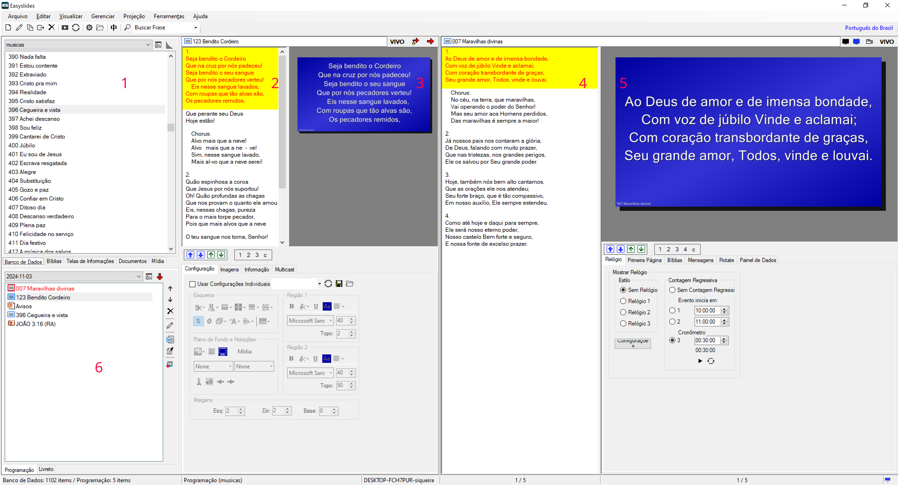
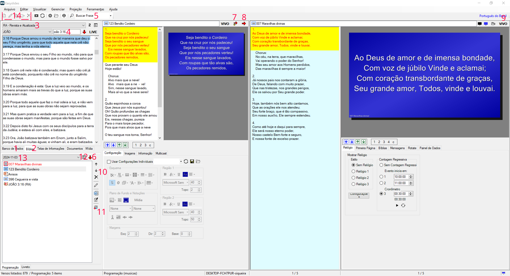

# Tutorial do Easyslides

## Principais painéis:

1. Exibe as músicas e as Bíblias do banco de dados.
2. Exibe a música ou versículo selecionado do banco de dados (painel 1) ou da programação atual (painel 6).
3. Tela de prévia de apresentação, mostra qual parte da música ou versículo selecionado vai aparecer na projeção.
4. A música ou versículo que está aparecendo na projeção.
5. Tela de apresentação, mostra qual parte da música ou versículo que está aparecendo na projeção.
6. Programação atual.

## Principais opções:

- a. Seleciona os bancos de dados de músicas.
- b. Seleciona as Bíblias.
- c. Seleciona a versão da Bíblia ou o banco de músicas a ser utilizado. (No momento temos somente um banco de músicas, mas poderíamos criar um banco de músicas só pro cantor cristão, outro só para corinhos, etc).
- d. Procura um versículo da Bíblia
- e. Procura uma música do banco de dados. (Pode procurar por título, por verso, por palavra, pelo que quiser...).
- f. Envia a música selecionada do banco de dados para a programação atual.
- g. Envia a música selecionada (do banco ou da programação) para a tela de apresentação e envia a próxima música da programação para a tela de prévia.
- h. Envia a música selecionada (do banco ou da programação) para a tela de apresentação, mas não altera a tela de prévia.
- i. Inicia/interrompe a apresentação.
- j. Opções de mudar a ordem das músicas na programação ou excluir uma música da programação.
- k. É possível adicionar um arquivo externo para a programação, como um powerpoint ou um vídeo. Pode ser clicando nesse ícone ou arrastando o arquivo da pasta para aqui dentro do painel de programação.
- l. Cria novas programações e edita as existentes.
- m. Seleciona uma programação.
- n. Botões que alteram o banco de músicas: Cria uma nova música, edita a música selecionada, copia/move a música para outro banco, ou exclui a músicado banco.

Para mudar a estrofe da música na apresentação, você pode apertar as teclas para baixo ↓ e para cima ↑. Você também pode clicar diretamente na estrofe da música para mudar na apresentação.

Para mudar a apresentação para a próxima música ou música anterior da programação, você pode apertar as teclas para direita → e para esquerda ←.